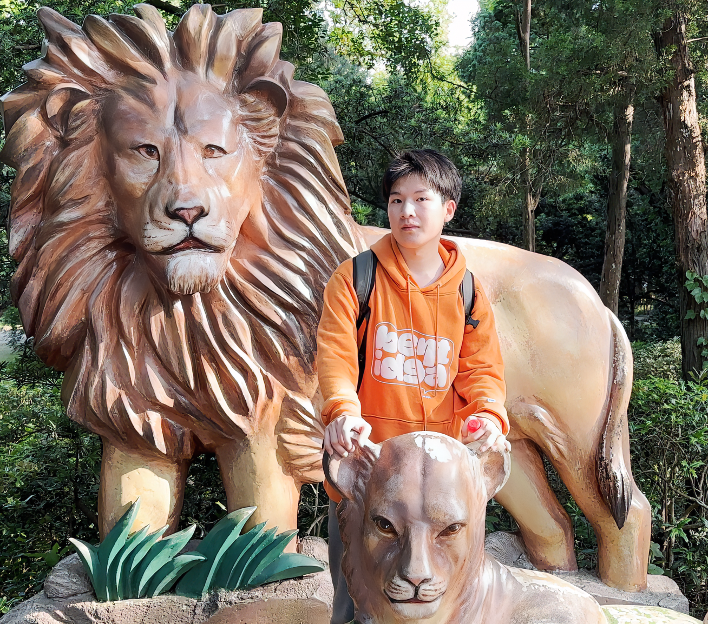

> Nice to meet you !!!😊 Hope you are happy every day!!!💥

## Biography

I am a MS student 🙂 at **Nanjing University** (2023.09—2026.06 if everything goes as expected), supervised by Prof. [*Limin Wang*](https://scholar.google.com.hk/citations?user=HEuN8PcAAAAJ&hl=zh-CN&oi=ao). Previously, I received a bachelor degree from **Chongqing University** in 2023.06 (Major in computer science and technology 🖥️, GPA: 3.9/4.0 overall rank: 1/295). I am also working as a research intern in [Shanghai AI lab](https://www.shlab.org.cn/) (2023.07—present). Before that, I worked as an intern in [SenseTime](https://www.sensetime.com) (2022.10—2023.06).

<!-- ## Academic Background

**[Highlight] I am looking for PhD to start in 2025 Fall. Contact me if you have any leads!** [talk with me](https://calendly.com/lancecai/meet-with-lance)

- **Sep 2020 - June 2024:** Fuzhou University (BEng)
- **Sep 2020 - May 2024:** Maynooth University (BSc)
- **June 2022 - Nov 2022:** Cambridge University (Intern)

 

--- -->

## Research Interests

My research interests lies at the computer vision and multimodal:

- Vision-Language Representation Learning
- Vision Foundation Models
- Multimodal Instruction-following Agents
- Parameter-Efficient Transfer Learning

I am particularly interested in the progress of the above direction in the field of **video understanding**. Currently, I am researching large-scale video-text pre-training and the establishment of video foundation models.
 <!-- Additionally, I am researching how to utilize pre-trained language models for creating multimodal instruction-following agents that can understand videos excellently. -->

---

## News and Updates

- **June 2023：**Happy to graduate from Chongqing University. Thank you to all my classmates and teachers.

 
