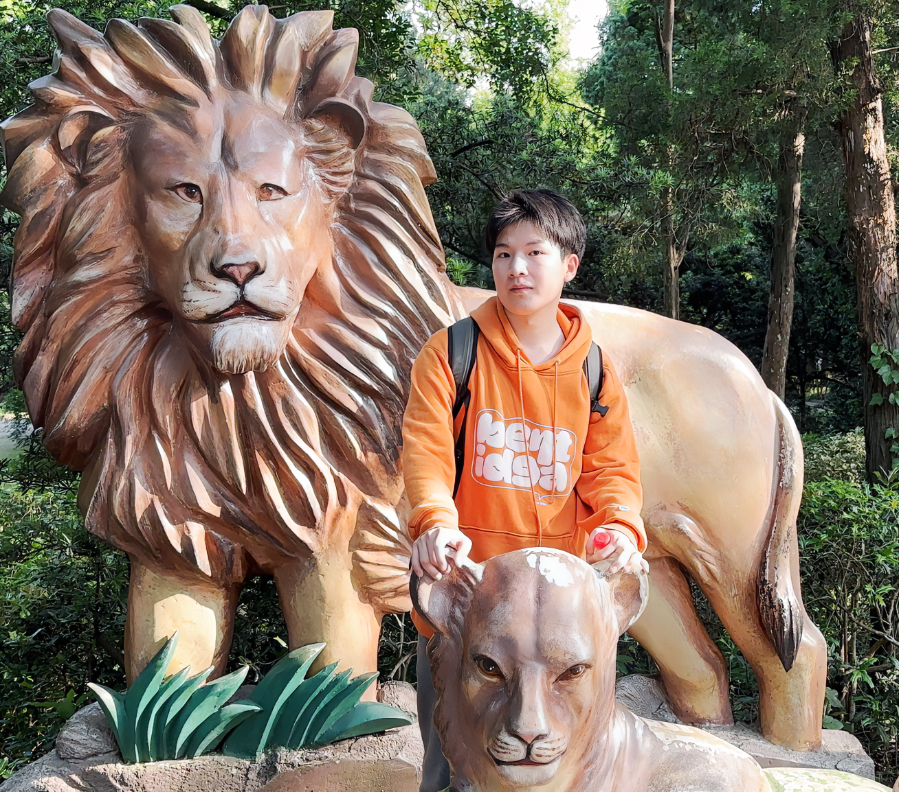

<!-- > Nice to meet you !!!😊 Feel free to contact me! Hope you are happy every day!!!💥 -->

## Biography

> Nice to meet you !!!😊  Feel free to contact me! My email is **xinhaoli00@outlook.com**. 

I am a MS student 🙂 at **Nanjing University** (2023.09—2026.06 if everything goes as expected), supervised by Prof. [*Limin Wang*](https://scholar.google.com.hk/citations?user=HEuN8PcAAAAJ&hl=zh-CN&oi=ao). Previously, I received a bachelor degree from **Chongqing University** in 2023.06 (Major in computer science and technology 🖥️, GPA: 3.9/4.0 overall rank: 1/295). I am working as a intern in [Moonshot AI](https://www.moonshot.cn/). Before that, I worked as a research intern in [Shanghai AI lab](https://www.shlab.org.cn/) (2023.07—2025.04) and [SenseTime](https://www.sensetime.com) (2022.10—2023.06).

## Research Interests

1. Building and Evaluation of **Video Foundation Models 🚀**

    - Scaling Video Foundation Models：***InternVideo2***
    - Scaling Video-Language Data: *InternVid*
    - Efficient Model Architecture of Video Foundation Model: *Videomamba, ZeroI2V*
    - Evaluation of Video Foundation Models: *VideoEval*
2. Building and Evaluation of **Multimodal Language Models (MLLM) 🦜**

    - Fine-Grained and Long Video Understanding: ***VideoChat-Flash**，**InternVideo2.5**，TimeSuite，TPO*
    - Model and Benchmark for Online Video Understanding: ***VideoChat-Online/OVBench**，StreamForest/ODV-Bench*
    - Benchmark for Video Caption and Retrieval: *CaReBench*
    - Benchmark for Complex Video Reason: *VideoReasonBench* 
3. Post-Finetuning for MLLM with **Reinforcement Learning 💪**

   - GRPO for Spatial-Temporal Perception: ***VideoChat-R1***
   - GRPO for Visual Test-Time Scaling: *VTTS*
   - GRPO for Video Caption: *VideoCap-R1*
   - DPO for Long Video Understanding: *LongVPO*

---

## News and Updates
- **Apr 2025:** 🔥🔥🔥We present [VideoChat-R1](https://arxiv.org/abs/2504.06958), a new attempt of R1-style training for Video MLLM.
- **Feb 2025:** One paper accepted by ICLR2025 and two papers accepted by CVPR2025.

- **Jan 2025:** 🔥🔥🔥We present [VideoChat-Flash](https://internvideo.github.io/blog/2024-12-31-VideoChat-Flash/) and [VideoChat-Online](https://videochat-online.github.io/), new video mllms and benchmarks for long video understanding.
- **Jul 2024:** Three papers accepted by ECCV2024.
- **Mar 2024:** 🔥🔥🔥We present [InternVideo2](https://arxiv.org/pdf/2403.15377.pdf), the currently largest (6B parameters) and most powerful video foundation model.
- **Mar 2024:** We present [VideoMamba](https://arxiv.org/abs/2403.06977), an efficient video backbone architecture with the potential to serve as an alternative to the video transformer architecture.
- **Jan 2024:** One paper accepted by ICLR2024 (spotlight).
- **Dec 2023:** Accepted by 🐼.
- **June 2023** Happy to graduate from Chongqing University. Thank you to all my classmates and teachers.

 
