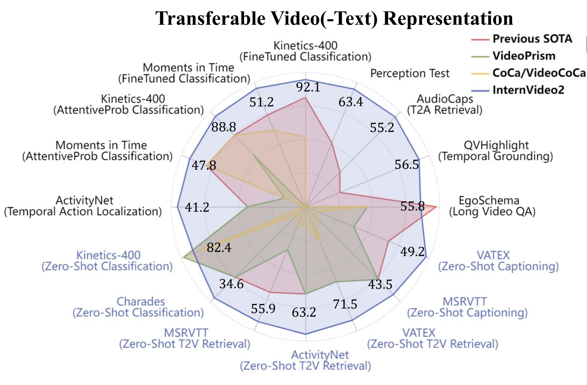
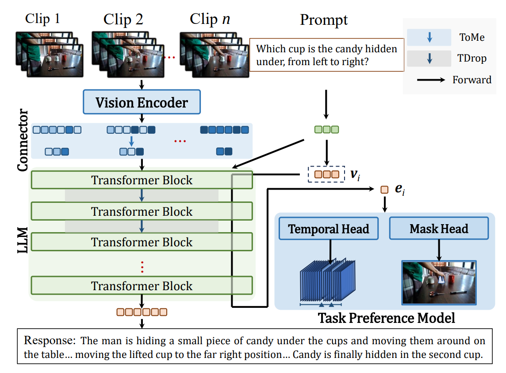
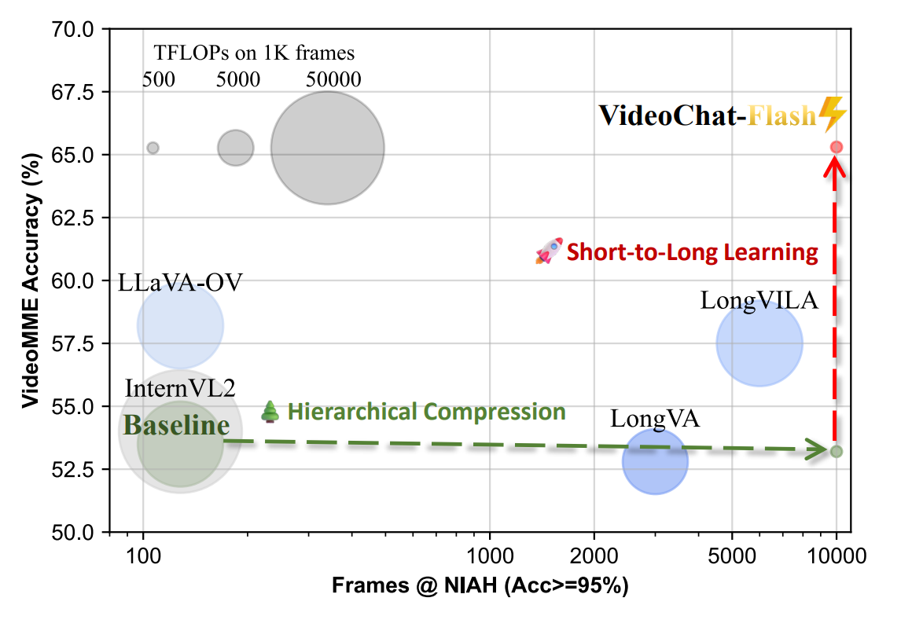
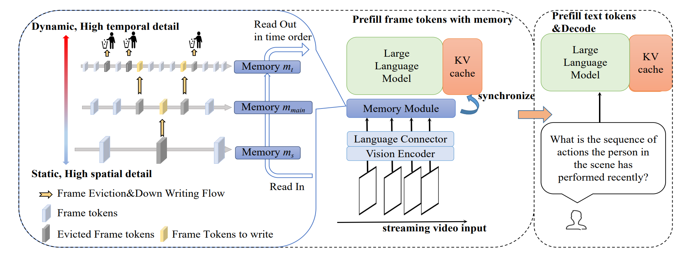
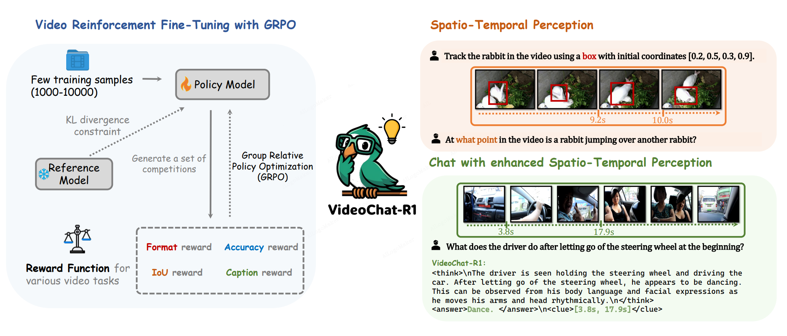
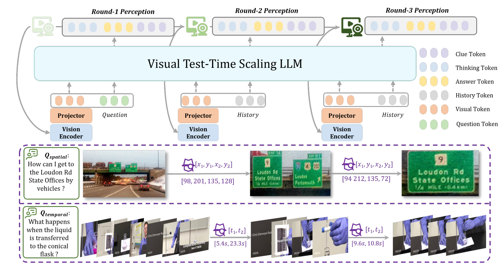
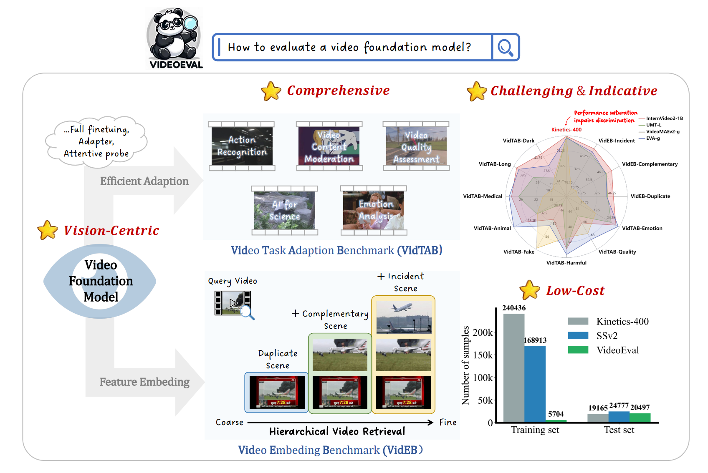
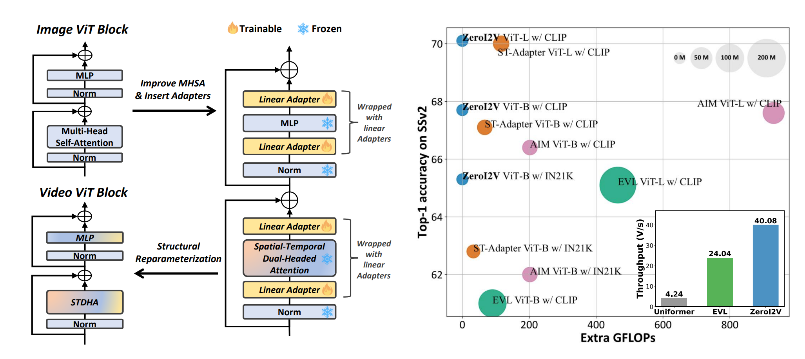
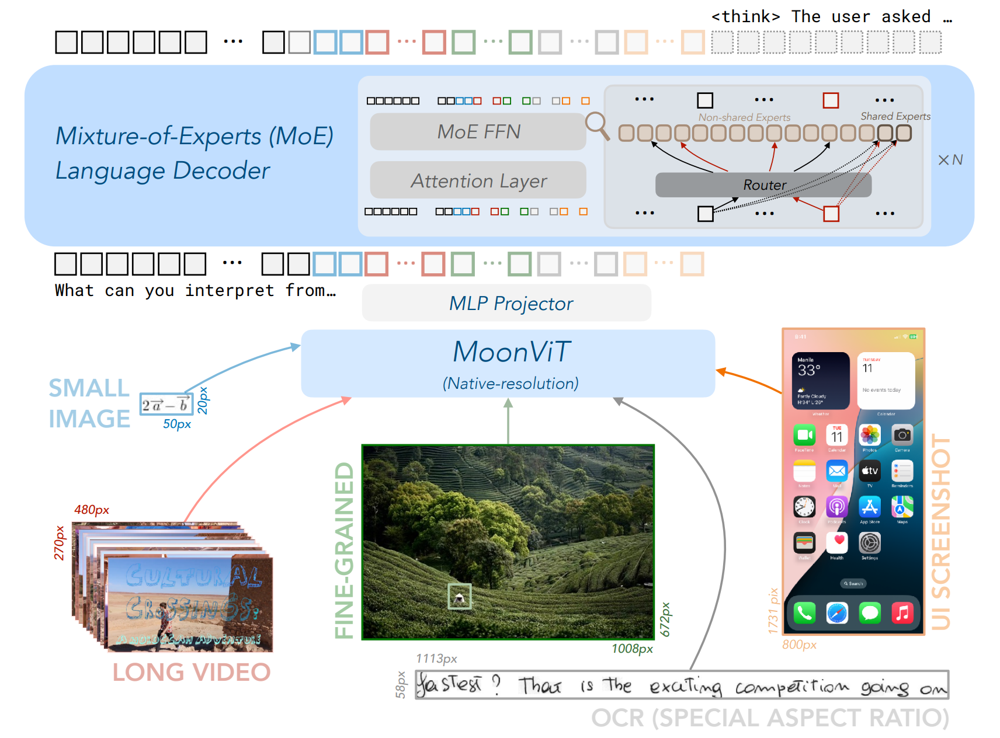

# Selected
\* equal contribution

> ***InternVideo2: Scaling Foundation Models for Multimodal Video Understanding.*** [[Paper]](https://arxiv.org/pdf/2403.15377.pdf)[[Code]](https://github.com/OpenGVLab/InternVideo/tree/main/InternVideo2)

Yi Wang\*, Kunchang Li\*, **Xinhao Li\***, Jiashuo Yu\*, Yinan He\*, Guo Chen, Baoqi Pei, Rongkun Zheng, Jilan Xu, Zun Wang, Yansong Shi, Tianxiang Jiang, SongZe Li, hongjie Zhang, Yifei Huang, Yu Qiao, Yali Wang, Limin Wang (\* Equal contribution) **(ECCV2024)**

> ***InternVideo2.5: Empowering Video MLLMs with Long and Rich Context Modeling***  [[Paper]](https://arxiv.org/abs/2501.12386)[[Code]](https://github.com/OpenGVLab/InternVideo/tree/main/InternVideo2.5)

Yi Wang\*,  **Xinhao Li\***, Ziang Yan\*, Yinan He\*, Jiashuo Yu\*, Xiangyu Zeng, Chenting Wang, Changlian Ma, Haian Huang, Jianfei Gao, Min Dou, Kai Chen, Wenhai Wang, Yu Qiao, Yali Wang, Limin Wang

> ***VideoChat-Flash: Hierarchical Compression for Long-Context Video Modeling*** [[Paper]](https://arxiv.org/abs/2501.00574)[[Code]](https://github.com/OpenGVLab/VideoChat-Flash)

**Xinhao Li\***, Yi Wang\*, Jiashuo Yu\*, Xiangyu Zeng, Yuhan Zhu, Haian Huang, Jianfei Gao, Kunchang Li, Yinan He, Chenting Wang, Yu Qiao, Yali Wang, Limin Wang

> ***Online Video Understanding: OVBench and VideoChat-Online*** [[Paper]](https://arxiv.org/abs/2501.00584v2)

Zhenpeng Huang\*, **Xinhao Li\***, Jiaqi Li\*, Jing Wang, Xiangyu Zeng, Cheng Liang, Tao Wu, Xi Chen, Liang Li, Limin Wang  **(CVPR2025)**

> ***VideoChat-R1: Enhancing Spatio-Temporal Perception via Reinforcement Fine-Tuning.*** [[Paper]](https://arxiv.org/abs/2504.06958)[[Code]](https://github.com/OpenGVLab/VideoChat-R1)

**Xinhao Li\***, Ziang Yan\*, Desen Meng, Lu Dong, Xiangyu Zeng, Yinan He, Yali Wang, Yu Qiao, Yi Wang, Limin Wang

> ***VideoChat-R1.5: Visual Test-Time Scaling to Reinforce Multimodal Reasoning by Iterative Perception.*** [[Paper]](https://arxiv.org/abs/2509.21100)[[Code]](https://github.com/OpenGVLab/VideoChat-R1)

 Ziang Yan\*， **Xinhao Li\***, Yinan He\*, Zhengrong Yue, Xiangyu Zeng, Yali Wang, Yu Qiao, Limin Wang, Yi Wang **(NIPS2025)**

> ***VideoEval: Comprehensive Benchmark Suite for Low-Cost Evaluation of Video Foundation Model.*** [[Paper]](https://arxiv.org/abs/2407.06491)[[Code]](https://github.com/leexinhao/VideoEval)

**Xinhao Li**, Zhenpeng Huang, Jing Wang, Kunchang Li, Limin Wang

> ***ZeroI2V: Zero-Cost Adaptation of Pre-Trained Transformers from Image to Video.*** [[Paper]](https://arxiv.org/abs/2310.01324)[[Code]](https://github.com/leexinhao/ZeroI2V)

**Xinhao Li**, Yuhan Zhu, Limin Wang **(ECCV2024)**

> ***Kimi-VL: Mixture-of-Experts Vision-Language Model for Multimodal Reasoning, Long-Context Understanding, and Strong Agent Capabilities*** [[Paper]](https://github.com/MoonshotAI/Kimi-VL/blob/main/Kimi-VL.pdf)[[Code]](https://github.com/MoonshotAI/Kimi-VL)

Kimi Team

# All

See my [Google Scholar](https://scholar.google.com/citations?user=evR3uR0AAAAJ).
